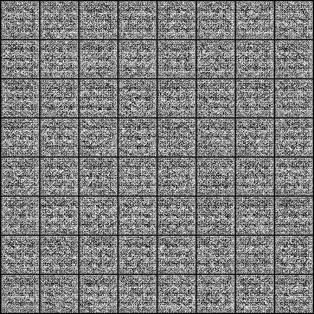
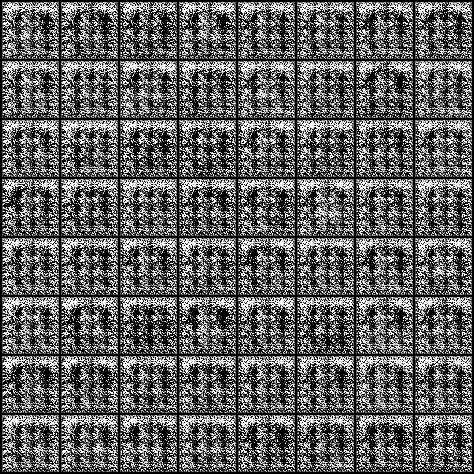
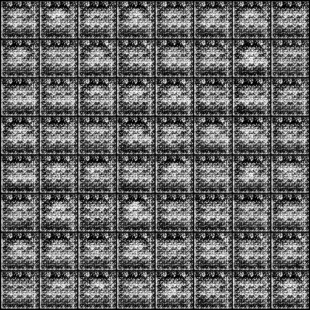
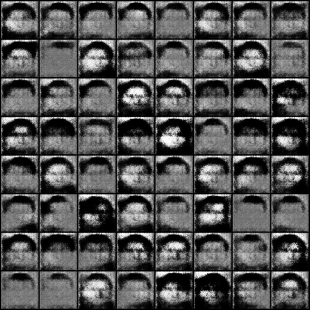
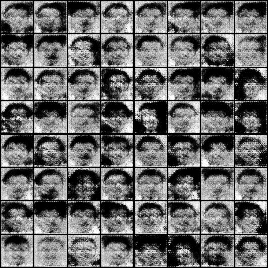
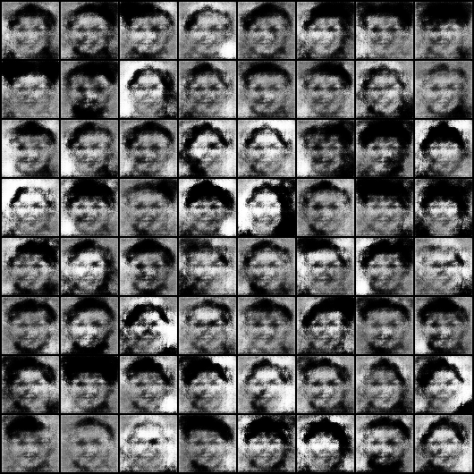
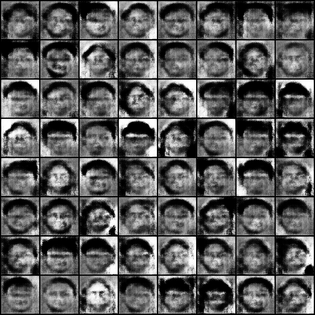
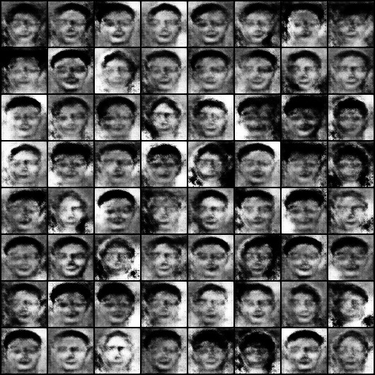
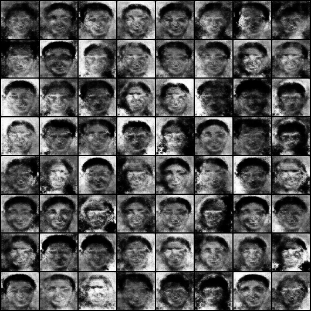
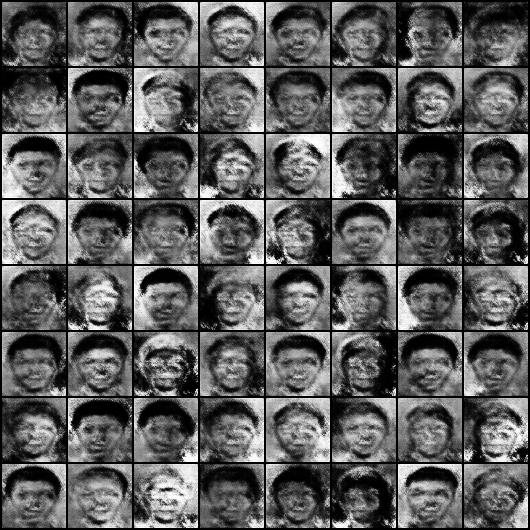

# DCGAN Face Generation - Training Progress

This directory contains the progression of generated images from a Deep Convolutional Generative Adversarial Network (DCGAN) trained on a face dataset. 

Over the course of 300 epochs, the model learns to generate increasingly better in structure human faces from random noise. The images below demonstrate the remarkable improvement of the Generator network at various stages of the training process.

## Epoch Progression

Here are 10 snapshots showing the milestone improvements of the generated outputs:

### Epoch 1: Initial State
- The generator starts with random noise and produces completely unstructured patterns.

### Epoch 35: Early Structural Formation
- The network begins to understand very basic mosaic and shapes, roughly resembling some type of facial structures.

### Epoch 70: Emerging Features
- Facial Features start to form, though heavily distorted.

### Epoch 105: Refining Features
- The contours and facial landmarks become more defined, though artifacts are still highly visible.

### Epoch 140: Clearer Face Shapes
- Skin tones normalize and overall facial shapes look much closer to human proportions.

### Epoch 175: Improving Detailing
- Hair boundaries, lighting, and expressions show distinct refinement.

### Epoch 210: Maturing Textures
- The network is now effectively removing prominent artifacts, yielding smoother textures.

### Epoch 245: Facial Structures
- The generated faces are slowly starting to appear, closely mirroring the diversity in the training dataset.

### Epoch 280: Fine-Tuning
- Minor details and distribution of color bands balancing are improved continually.

### Epoch 300: Final Output
- The final epoch showcases the best result the generator can produce after full training, demonstrating face synthesis capabilities despite the limited constraints.

## Conclusion

Creating this set of progression images serves as a proof of work showing the gradual process of the Generator network fooling the Discriminator over iterations. It highlights the power of adversarial training in arriving at complex, high-dimensional distributions like those of human facial structures.

### Note
The faces still don't look realistic and distinguishing because of the limited dataset used which are also further downsampled due to limiting constraints with the resources to train. And given that if it had been trained to more epochs let's say around 800+, the results could have been distinguishing and better looking.
